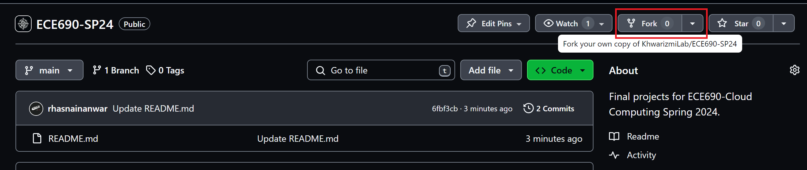
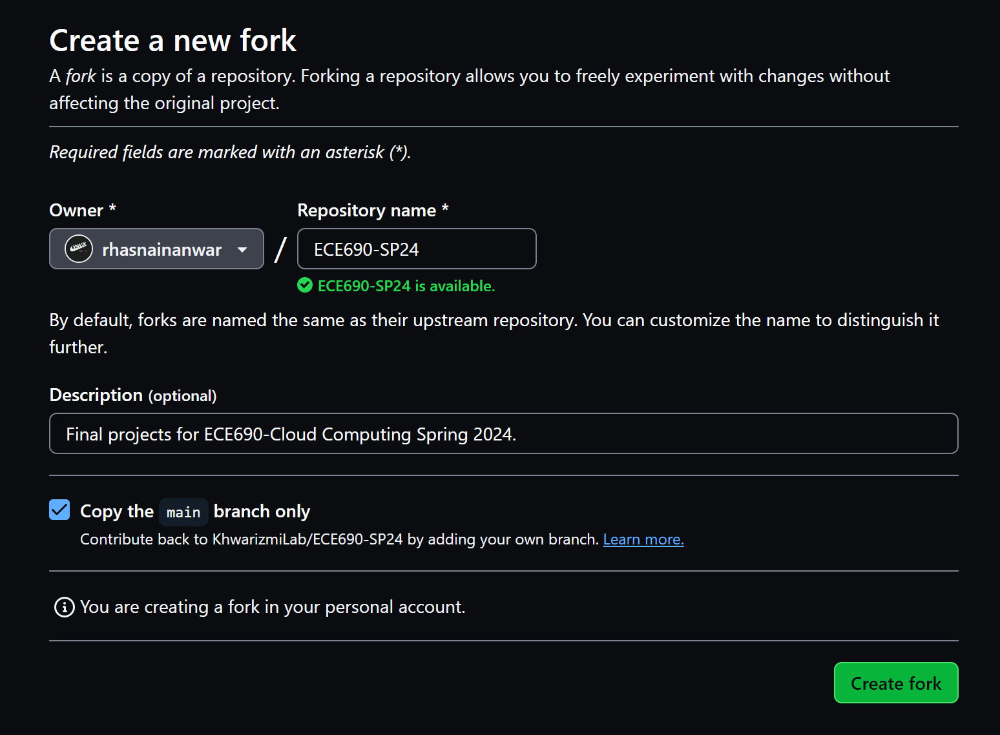
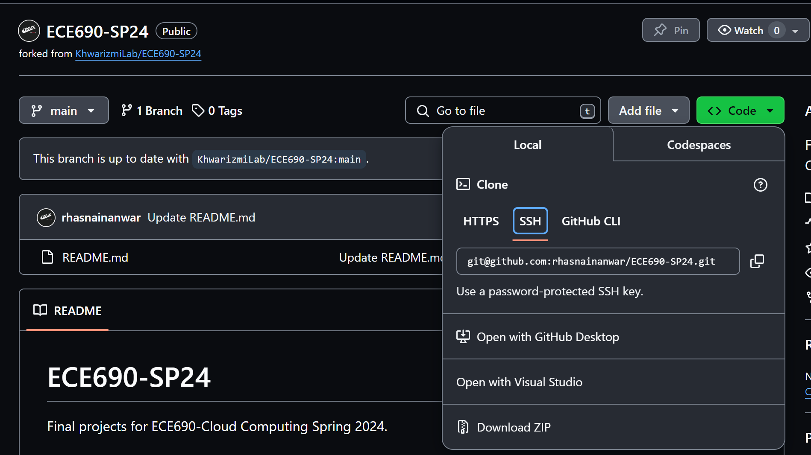
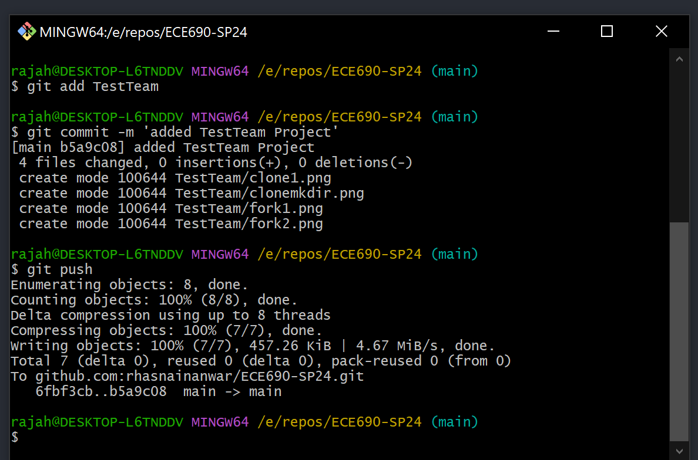
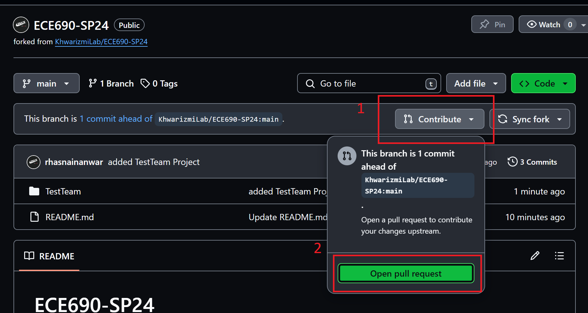
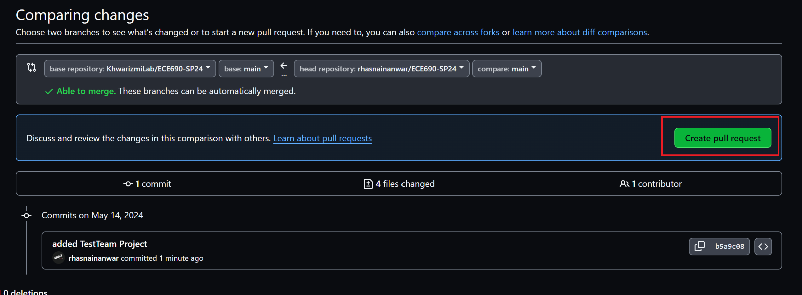
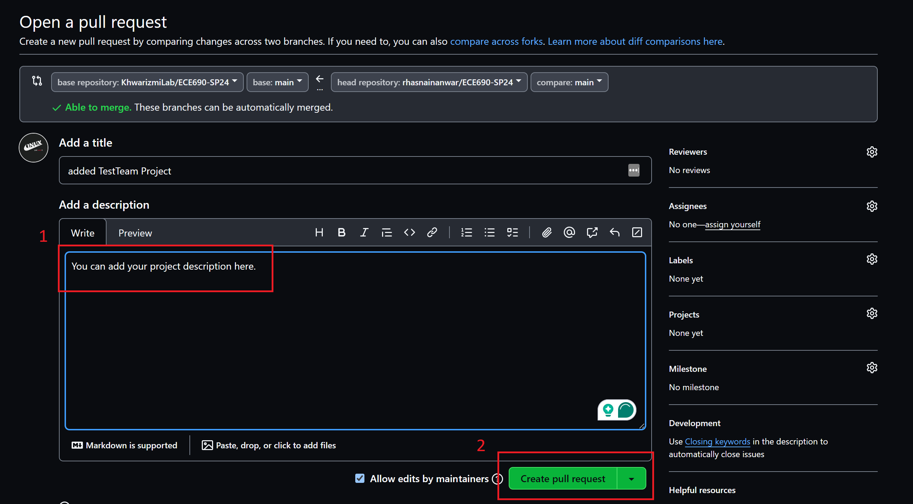

# ECE690-SP24
Final projects for ECE690-Cloud Computing Spring 2024.

# Directions for Groups
1. Fork the repo.
2. Clone the repo.
3. Create a new folder with your Team's name and add all your code and latex files.
4. Commit and push changes to your copy of the repo.
5. Create a pull request.


## 1. Fork
#### Create a fork (copy) of *this* repo by clicking the `Fork` button on top right.


#### Make sure you have selected the correct account for Fork, and click `Create fork'`to initiate copy.



## 2. Clone
#### Download the *forked* repo by clicking `Code` button on top right.
You can use `SSH` or `HTTPS` based on how your GitHub account is set up.


## 3. Team Folder
#### Open a terminal and clone the *forked* repo.
If you copied the `HTTPS` link, you will be asked to provide the username and password.
Create a new folder with your Team's name and copy all your files in this folder.


## 4. Commit and Push Changes
Make sure you are in the repo base directory. If you are in your TeamFolder, do `cd ..`.
```
git add <Team Folder Name>
git commit -m '<appropriate message>'
git push
```


## 5. Pull Request




